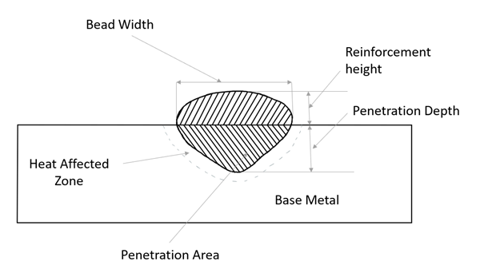

#  Introduction

In this experiment, we examine the impact of several welding parameters, such as welding current, speed, and voltage. These variables control the heat input rate, which melts the base metal and filler wire. The effect of weld parameters on the size and geometry of the weld bead will be studied in this experiment. A schematic diagram of the weld bead with the nomenclature of the bead geometry is given below in Figure 1.

##### Fig. 1 : A schematic diagram of the weld bead geometry 

# Theory:

***(i) Effect of Welding Current***

Welding current is an essential characteristic that influences the bead profile of the weld. In SMAW the current can be either AC or DC depending on the electrode that is used. The magnitude of the electric current will directly influence the melting rate of the electrode and the heat transferred to the workpiece. The electrode is usually connected to the positive terminal for consumable electrode welding process like SMAW. The heating rate of the electrode will be higher in DC than in AC due to the constant change is polarity for AC current. 

Welding current controls the quantity of melted base material, HAZ, and penetration depth. Increased welding current results in higher heating and melting rate of the electrode and workpiece. This results in increase in the width of the weld bead and depth of penetration. 
Welding issues such as an unstable arc, poor penetration are consequences of a low welding current.

***(ii) Effect of Welding Voltage***

The change in the welding voltage is usually determined by the length of the arc, i.e. the voltage increases with an increase in arc length. The cross-section of the weld bead increases by the rise in voltage as the arc becomes wider arc. On the contrary, too much increase in arc length, will lead to arc wandering and scattering of the molten metal. Raising the voltage while maintaining the current constant will cause the penetration to be shallower, and the weld bead to be broader.

Arc voltage above the optimal value generates a broad weld which is prone to cracks, and undercut and makes the removal of slag more difficult. Reduced weld voltage generates a more intense arc, which enhances penetration. An excessive reduction in arc voltage produces narrow beads and makes it harder to remove slag from the weld bead.

***(iii) Effect of Welding Speed***

The speed of the arc across the weld bead effects how much heat is added per unit length of the weld bead. When welding speed is increased, the amount to heat added per unit length of the weld bead reduces. Hence, the amount of electrode and workpiece that is melted along the weld line in reduced. This means that there are fewer weld reinforcements and the weld is thin. High weld velocity causes porosity, undercut, irregular weld form, arc blow, cracks, and a rise in the insertion of slag in the welded joint. A comparatively slow welding speed allows the molten metal’s gases to escape, which lowers porosity, and the weld bead obtained is much wider as compared to higher welding speed because welding speed is inversely proportional to the bead width.

***(iv) Effect of Electrode Diameter***

The diameter of the electrode is another crucial factor. Higher welding currents can be carried by larger electrodes. However, smaller electrodes result in faster deposition rates for a given amperage. The deposition rate and depth can be increased by reducing the electrode diameter while maintaining the same current.

